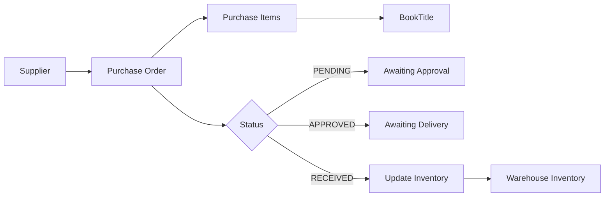
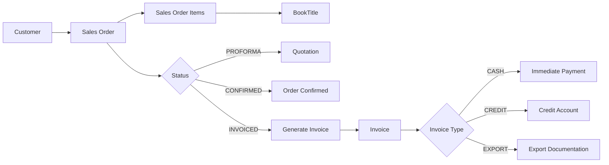
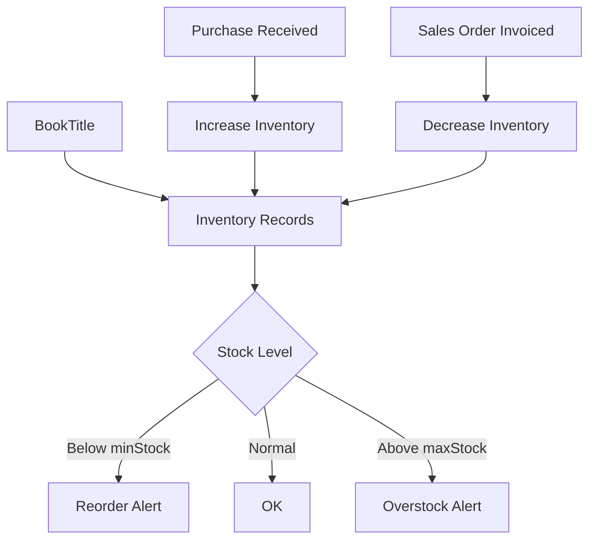

# ERP Database Schema - Visual Overview

## Entity Relationship Diagram

```mermaid
erGraph TD
    %% Core Entities
    User[User<br/>id, name, email, password<br/>role, branchId]
    Branch[Branch<br/>id, name, address<br/>isHeadOffice]
    Warehouse[Warehouse<br/>id, name, branchId]
    
    %% Business Entities
    Customer[Customer<br/>id, name, gstNumber<br/>creditLimit, outstandingAmount<br/>discountPercent, branchId]
    Supplier[Supplier<br/>id, name, contactInfo]
    BookTitle[BookTitle<br/>id, isbn, title<br/>author, publisher, price]
    
    %% Inventory
    Inventory[Inventory<br/>id, bookTitleId, warehouseId<br/>quantity, minStock, maxStock]
    
    %% Purchase Flow
    Purchase[Purchase<br/>id, supplierId, status]
    PurchaseItem[PurchaseItem<br/>id, purchaseId, bookTitleId<br/>quantity, costPrice]
    
    %% Sales Flow
    SalesOrder[SalesOrder<br/>id, customerId, status<br/>totalAmount]
    SalesOrderItem[SalesOrderItem<br/>id, salesOrderId, bookTitleId<br/>quantity, sellingPrice, discount]
    Invoice[Invoice<br/>id, salesOrderId, invoiceNumber<br/>invoiceType, gstAmount, totalAmount]
    
    %% Relationships
    Branch -->|1:N| User
    Branch -->|1:N| Warehouse
    Branch -->|1:N| Customer
    
    Warehouse -->|1:N| Inventory
    BookTitle -->|1:N| Inventory
    
    Supplier -->|1:N| Purchase
    Purchase -->|1:N| PurchaseItem
    BookTitle -->|1:N| PurchaseItem
    
    Customer -->|1:N| SalesOrder
    SalesOrder -->|1:N| SalesOrderItem
    SalesOrder -->|1:1| Invoice
    BookTitle -->|1:N| SalesOrderItem
```

## Data Flow Diagrams

### Purchase Flow


### Sales Flow


### Inventory Management


## Model Hierarchy

### Organizational Structure
```
Branch (Head Office / Regional)
├── Users (ADMIN, HO, BRANCH, SALES)
├── Warehouses
│   └── Inventory (per BookTitle)
└── Customers
    └── Sales Orders
        ├── Sales Order Items
        └── Invoice (1:1)
```

### Product Management
```
BookTitle (Master Data)
├── Inventory (per Warehouse)
├── Purchase Items (Procurement)
└── Sales Order Items (Sales)
```

### Procurement Chain
```
Supplier
└── Purchase Orders
    └── Purchase Items
        └── BookTitle
            └── Updates Inventory
```

## Key Relationships Summary

| Parent | Child | Type | Cascade Delete |
|--------|-------|------|----------------|
| Branch | User | 1:N | No |
| Branch | Warehouse | 1:N | Yes |
| Branch | Customer | 1:N | Yes |
| Warehouse | Inventory | 1:N | Yes |
| BookTitle | Inventory | 1:N | Yes |
| BookTitle | PurchaseItem | 1:N | Yes |
| BookTitle | SalesOrderItem | 1:N | Yes |
| Supplier | Purchase | 1:N | Yes |
| Purchase | PurchaseItem | 1:N | Yes |
| Customer | SalesOrder | 1:N | Yes |
| SalesOrder | SalesOrderItem | 1:N | Yes |
| SalesOrder | Invoice | 1:1 | Yes |

## Enums Overview

### UserRole
- **ADMIN**: Full system access
- **HO**: Head office operations
- **BRANCH**: Branch-level operations
- **SALES**: Sales operations only

### PurchaseStatus
- **PENDING**: Order created, awaiting approval
- **APPROVED**: Order approved, awaiting delivery
- **RECEIVED**: Goods received, inventory updated

### SalesOrderStatus
- **PROFORMA**: Quotation/Proforma invoice
- **CONFIRMED**: Order confirmed by customer
- **INVOICED**: Tax invoice generated

### InvoiceType
- **CASH**: Cash sale (immediate payment)
- **CREDIT**: Credit sale (payment terms)
- **EXPORT**: Export sale (special documentation)

## Index Strategy

### Performance Indexes
- **User**: `email`, `branchId` - Fast authentication and filtering
- **BookTitle**: `isbn`, `title` - Quick book lookups and search
- **Inventory**: `quantity` - Low stock alerts
- **Customer**: `gstNumber` - Tax compliance queries
- **SalesOrder**: `status`, `createdAt` - Order management
- **Invoice**: `invoiceNumber`, `createdAt` - Invoice lookups

### Unique Constraints
- **User.email** - One account per email
- **BookTitle.isbn** - Unique book identification
- **Inventory (bookTitleId, warehouseId)** - One record per book per warehouse
- **Invoice.salesOrderId** - One invoice per order
- **Invoice.invoiceNumber** - Unique invoice numbers

## Business Rules Enforced

1. **Inventory Uniqueness**: Each book can have only one inventory record per warehouse
2. **Invoice Uniqueness**: Each sales order can have only one invoice
3. **Cascade Deletes**: Deleting parent records automatically removes dependent records
4. **Default Values**: Sensible defaults for numeric fields (0) and status fields
5. **Timestamps**: Automatic tracking of creation and update times
6. **Optional Fields**: Flexible schema with optional fields where appropriate

## Common Query Patterns

### Low Stock Alert
```sql
SELECT * FROM Inventory 
WHERE quantity <= minStock
```

### Customer Outstanding
```sql
SELECT * FROM Customer 
WHERE outstandingAmount > 0
ORDER BY outstandingAmount DESC
```

### Pending Purchases
```sql
SELECT * FROM Purchase 
WHERE status = 'PENDING'
ORDER BY createdAt ASC
```

### Recent Invoices
```sql
SELECT * FROM Invoice 
WHERE createdAt >= NOW() - INTERVAL '30 days'
ORDER BY createdAt DESC
```

---

**Total Entities**: 12 models + 4 enums = 16 schema definitions  
**Total Relationships**: 20+ foreign key relationships  
**Total Indexes**: 25+ performance indexes  
**Cascade Deletes**: 15 relationships with cascade delete
